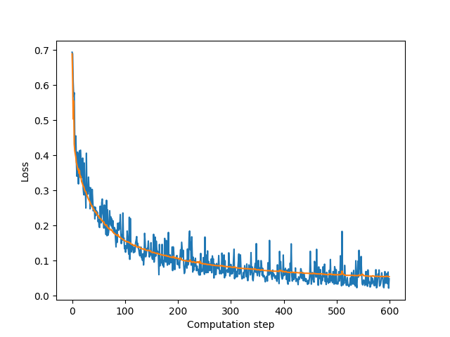
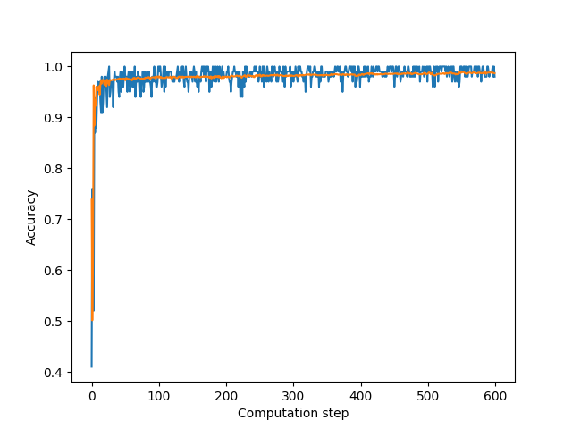

# Neural network

This is a neural network, which can be used as a universal function approximator. If there exists a function $$f : S \rightarrow \mathbb{R}$$ where we let $$S \subseteq \mathbb{R}^{n}$$ where $$\delta : \mathbb{R} \rightarrow \mathbb{R}$$ and $$\sigma > 0$$ we can write $$g(x) = \sum_{i=1}^{d} c_k \delta (a_k + b_{j}^{\top}x)$$ such that $$|g(x) - f(x)| < \sigma$$

This essentially means for any given continous function, there exists a neural network that will approximate the given function.

This repository contains an implementation of a feedforward neural network.
I have used a training set to train this neural network to output a classification based on the input. The training data is from the [MNIST](https://en.wikipedia.org/wiki/MNIST_database) database. To simplify my classifications, I have used the datasets of 9's and 3's to attempt to correctly classify these using the datasets as training data. The classification function is tried applied to *k* fold batches of the dataset, in addition to a test dataset.

## Forward pass

In order to calculate the needed values, including the gradient of a neuron with respect to the output loss (defined by a *loss function*), we calculate the forward layer $$\sigma (\textbf{x} \cdot \textbf{W} + \textbf{b})$$
where $\textbf{W}$ and $\textbf{b}$ are the weight matrices and bias matrices respectively. $\sigma(z)$ is the activation function for each neuron at that layer. The sigmoid function and ReLU are implemented.
The forward layer is calculated for each layer until the last layer, keeping track of each layer values.
We compute the gradient with respect all the weights. This requires us to compute the partial derivative of the error with respect to each weight.

$$\nabla e(w) = \frac{\partial e(w)}{\partial w_{ij}^{l}}$$
$$\frac{\partial e(w)}{\partial w_{ij}^{l}} = \frac{\partial e(w)}{\partial \Sigma_{ij}^{l}} \times \frac{\partial \Sigma_{ij}^{l}}{\partial w_{ij}^{l}}$$
$$= \delta^{l} \times x_i^{l-1}$$ 
where $\delta^{l}$ is the partial derivative of the error w.r.t. the sum of the weights to node $j$ in layer $l$, e.g. the unactivated node value.

## Backward pass

Backward pass refers to the process of adjusting your weights and biases using stochastic gradient descent. Thus our learning can be done in linear time. Here the computation is made from last layer to the first layer, hence it's name. This implementation uses the layer caches from each layer calculated in forward pass in order to calculate each loss in each layer. We also use mini batches of $n = 100$ by default. This is adjustable for your need. Every iteration we take a different batch of the training data and update the weight using the using the famous gradient descent $$W^{*} = W - \eta \nabla C$$ Here, the gradient C is simply calculated in backward pass. This iteration is repeated $\lfloor \frac{|n|}{|B|} \rfloor$ times for a set amount of epochs where $|n|$ and $|B|$ are number of samples and batch size respectively. 

### Efficiency and accuracy

The results of a successful label classification of the determined training set and it's results on the training set

    

The accuracy across each iteration

    

The values are calculated relative to both the mini-batch and training set. 

## What lies ahead?

Right now, the algorithm is fit to binary classification of two predefined data sets. The goal is to further generalise the algoritm in order to achieve a universal function approximator.